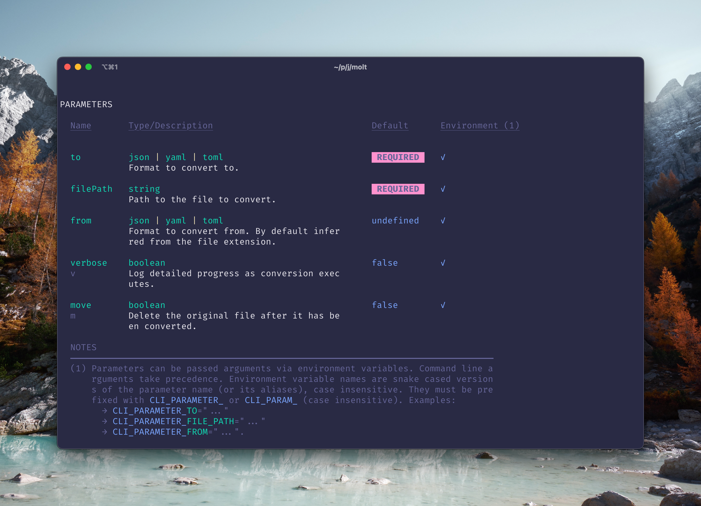
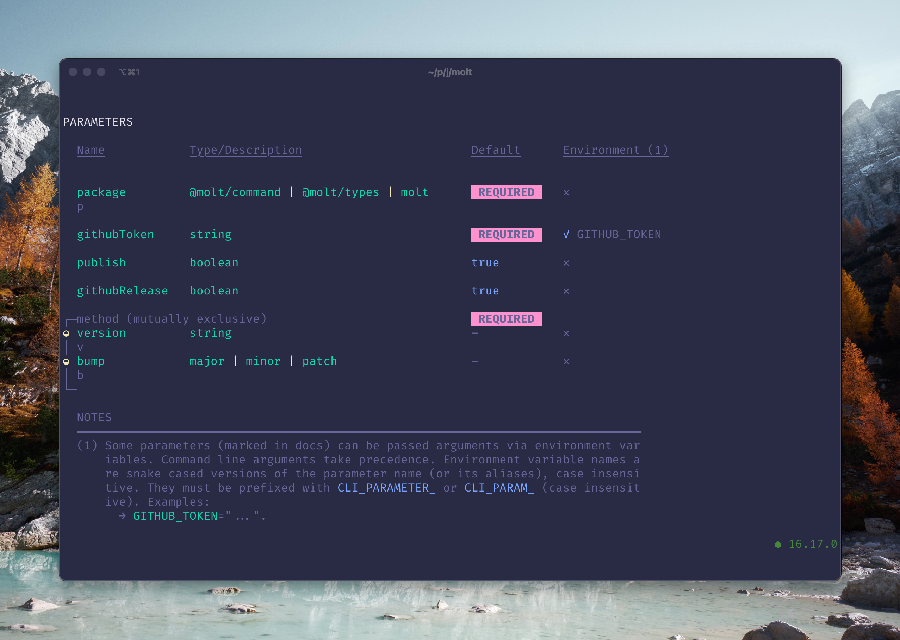

# @molt/command

🌱 Type-safe CLI command definition and execution.

<!-- toc -->

- [Installation](#installation)
- [Example](#example)
- [Features](#features)
  - [⛑ Type safe](#%E2%9B%91-type-safe)
  - [👘 Expressive parameter specification](#%F0%9F%91%98-expressive-parameter-specification)
  - [📖 Autogenerated help](#%F0%9F%93%96-autogenerated-help)
- [Video Introduction](#video-introduction)
- [Docs](#docs)
  - [Parameter Chains vs Object](#parameter-chains-vs-object)
  - [Parameter Naming](#parameter-naming)
    - [Property Name Syntax](#property-name-syntax)
    - [Flag Syntax](#flag-syntax)
    - [Short, Long, & Aliasing](#short-long--aliasing)
    - [Kebab / Camel Case](#kebab--camel-case)
    - [Type Safety](#type-safety)
  - [Parameter Types](#parameter-types)
    - [Zod Support](#zod-support)
    - [Boolean](#boolean)
    - [String](#string)
    - [Number](#number)
    - [Enum](#enum)
    - [Union](#union)
  - [Line Arguments](#line-arguments)
    - [Parameter Argument Separator](#parameter-argument-separator)
    - [Stacked Short Flags](#stacked-short-flags)
    - [Case](#case)
  - [Environment Arguments](#environment-arguments)
    - [Default Name Pattern](#default-name-pattern)
    - [Toggling](#toggling)
    - [Selective Toggling](#selective-toggling)
    - [Custom Prefix](#custom-prefix)
    - [Selective Custom Prefix](#selective-custom-prefix)
    - [Prefix Disabling](#prefix-disabling)
    - [Selective Prefix Disabling](#selective-prefix-disabling)
    - [Case Insensitive](#case-insensitive)
    - [Validation](#validation)
  - [Mutually Exclusive Parameters](#mutually-exclusive-parameters)
    - [Type Safety](#type-safety-1)
    - [Optional](#optional)
    - [Default](#default)
    - [Autogenerated Documentation](#autogenerated-documentation)
  - [Description](#description)
- [Recipes](#recipes)
  - [Optional Argument With Default Behavior](#optional-argument-with-default-behavior)
- [Architecture](#architecture)

<!-- tocstop -->

## Installation

```
npm add @molt/command zod
```

## Example

```ts
import { Command } from '../src/index.js'
import { z } from 'zod'

// prettier-ignore
const args = Command
  .parameter(`filePath`, z
    .string()
    .describe(`Path to the file to convert.`)
  )
  .parameter(`to`, z
     .enum([`json`, `yaml`, `toml`])
     .describe(`Format to convert to.`)
  )
  .parameter(`from`, z
     .enum([`json`, `yaml`, `toml`])
     .optional()
     .describe(`Format to convert from. By default inferred from the file extension.`)
  )
  .parameter(`verbose v`, z
     .boolean()
     .default(false)
     .describe(`Log detailed progress as conversion executes.`)
  )
  .parameter(`move m`, z
    .boolean()
    .default(false)
    .describe(`Delete the original file after it has been converted.`)
  )
  .parse()
```

```
my-binary --file ./music.yaml --to json
```

Autogenerated help:

```
my-binary --help
```



## Features

#### ⛑ Type safe

#### 👘 Expressive parameter specification

- Automatic casting and validation based on specified Zod types.
- Normalization between camel and kebab case and optional dash prefix:

  ```ts
  const args = Command.parameters({
    '--do-it-a': z.boolean(),
    '--doItB': z.boolean(),
    doItC: z.boolean(),
  }).parse()

  args1.doItA
  args2.doItB
  args3.doItC
  ```

- Specify one or multiple (aka. aliases) short and long flags:

  ```ts
  Command.parameters({ '-f --force --forcefully': z.boolean() }).parse()
  ```

- Use Zod `.default(...)` method for setting default values.

  ```ts
  const args = Command.parameters({ '--path': z.string().default('./a/b/c') }).parse()
  args.path === './a/b/c/' //   $ binary
  args.path === '/over/ride' // $ binary --path /over/ride
  ```

- Define [mutually exclusive parameters](#mutually-exclusive-parameters) declaratively.

- Use Zod `.describe(...)` to add parameter descriptions in autogenerated docs.

- 🤾‍♀️ Expressive argument passing

  - Pass via environment variables (customizable)

    ```ts
    const args = Command.parameters({ '--path': z.string() }).parse()
    args.path === './a/b/c/' // $ CLI_PARAM_PATH='./a/b/c' binary
    ```

  - Kebab or camel case flags
    ```
    $ binary --do-it
    $ binary --doIt
    ```
  - Parameter stacking e.g. `binary -abc` instead of `binary -a -b -c`
  - Separator of `=` or space, e.g. `binary -a=foo -b=bar` or `binary -a foo -b bar`

#### 📖 Autogenerated help




## Video Introduction

A [video introduction](https://www.youtube.com/watch?v=UtXM4FKCUDo) if you like that format:

[](https://www.youtube.com/watch?v=UtXM4FKCUDo)

## Docs

### Parameter Chains vs Object

You can define multiple parameters either with an object or with a method chain. The object style may feel more lightweight to you. However take note that the it is less type safe. Take for example this:

```ts
// prettier-ignore
const args = Command
  .parameters({
    'foo x': z.string(),
    'bar x': z.string(),
  })
  .parse()
```

There is a mistake above which is that two parameters want to use the short name `'x'`. This error is _statically_ caught with the chaining API 😎:

```ts
// prettier-ignore
const args = Command
  .parameter('foo x', z.string())
  .parameter('bar x', z.string())
  //         ~~~~~~~  <--- Your IDE will render a static error here thanks to Type Script and Molt's usage of it!
  .parse()
```

### Parameter Naming

#### Property Name Syntax

You can define parameters as a zod object schema using regular property names. These are flags for your CLI but arguments can also be passed by environment variables so in a way this is a neutral form that doesn't privilege either argument passing mechanism.

```ts
const args = Command.parameters({
  foo: z.string(),
  bar: z.number(),
  qux: z.boolean(),
}).parse()

args.foo
args.bar
args.qux
```

#### Flag Syntax

You can also define them using flag syntax if you prefer. Thanks to `@molt/types` this style doesn't sacrifice any type safety.

```ts
const args = Command.parameters({
  '--foo': z.string(),
  '--bar': z.number(),
  '--qux': z.boolean(),
}).parse()

args.foo
args.bar
args.qux
```

#### Short, Long, & Aliasing

You can give your parameters short and long names, as well as aliases.

A set of parameter names gets normalized into its canonical name internally (again thanks to `@molt/types` this is all represented statically as well). The canonical name choice is as follows:

1. The first long flag
2. Otherwise the first short flag

```ts
const args = Command.parameters({
  '--foobar --foo -f ': z.string(),
  '--bar -b -x': z.number(),
  '-q --qux': z.boolean(),
  '-m -n': z.boolean(),
}).parse()

// $ binary --foobar moo --bar 2 --qux -m
// $ binary --foo    moo  -x   2 --qux -m
// $ binary  -f      moo  -b   1  -q   -n
args.foobar === 'moo'
args.bar === 1
args.qux === true
args.m === true
```

If you prefer you can use a dash-prefix free syntax:

```ts
const args = Command.parameters({
  'foobar foo f ': z.string(),
  'bar b x': z.number(),
  'q qux': z.boolean(),
  'm n': z.boolean(),
}).parse()
```

#### Kebab / Camel Case

You can use kebab or camel case (and likewise your users can pass flags in either style). Canonical form internally uses camel case.

```ts
const args = Command.parameters({
  'foo-bar': z.string(),
  quxLot: z.string(),
}).parse()

// $ binary --foo-bar moo --qux-lot zoo
// $ binary --fooBar moo --quxLot zoo
args.fooBar === 'moo'
args.quxLot === 'zoo'
```

#### Type Safety

With the chaining API duplicate parameter names will be caught in TypeScript.

```ts
// prettier-ignore
const args = Command
  .parameter('f foo bar', z.string())
  .parameter('bar', z.string()) // <-- TS error: already taken
  .parameter('f', z.string()) //   <-- TS error: already taken
  .parameter('foo', z.string()) // <-- TS error: already taken
  .parameter('help', z.string()) // <-- TS error: reserved name
  .parameter('h', z.string()) // <-- TS error: reserved name
  .parse()
```

### Parameter Types

This section covers how parameters are typed via a subset of Zod schemas and the types used will affect parsing.

#### Zod Support

Only the following set of Zod types are supported. In addition to the docs below, static typing will raise an error if you pass in something invalid.

```ts
z.boolean()
z.string()
z.enum(['...', '...'])
z.number()
z.union([...]) // where ... can be any other type above.
```

Validation methods like `.min(1)` and `.regex(/.../)` should all just work.

The following modifiers are accepted:

```ts
.optional()
.default(...)
```

If both `optional` and `default` are used then `default` takes precedence.
The `describe` method is used for adding docs. It can show up in any part of the chain. All the following are fine:

```ts
z.string().describe('...').optional()
z.string().optional().describe('...')
z.string().min(1).describe('...').optional()
```

#### Boolean

- Flag does not accept any arguments.
- Environment variable accepts `"true"` or `"1"` for `true` and `"false"` or `"0"` for `false`.
- Negated form of parameters automatically accepted.

Examples:

```ts
const args = Command.parameters({ 'f force forcefully': z.boolean() }).parse()
// $ CLI_PARAM_NO_F='true' binary
// $ CLI_PARAM_NO_FORCE='true' binary
// $ CLI_PARAM_NO_FORCEFULLY='true' binary
// $ CLI_PARAM_F='false' binary
// $ CLI_PARAM_FORCE='false' binary
// $ CLI_PARAM_FORCEFULLY='false' binary
// $ binary --no-f
// $ binary --noF
// $ binary --no-force
// $ binary --noForce
// $ binary --no-forcefully
// $ binary --noForcefully
args.force === false
// $ CLI_PARAM_NO_F='false' binary
// $ CLI_PARAM_NO_FORCE='false' binary
// $ CLI_PARAM_NO_FORCEFULLY='false' binary
// $ CLI_PARAM_F='true' binary
// $ CLI_PARAM_FORCE='true' binary
// $ CLI_PARAM_FORCEFULLY='true' binary
// $ binary -f
// $ binary --force
// $ binary --forcefully
args.force === true
```

#### String

- Flag expects an argument.

##### Validations

- `startsWith` - A prefix the value must be begin with.
- `endsWith` - A suffix the value must end with.
- `regex` - An arbitrary Regular Expression that the value must conform to.
- `min` - The minimum allowed string length
- `max` - The maximum allowed string length
- `length` - An exact length the string must be
- `pattern` - Different well known patterns that the value must conform to.
  - `email` - An email
  - `url` - A URL
  - `uuid` - A [UUID](https://www.ietf.org/rfc/rfc4122.txt)
  - `cuid` - A [CUID](https://github.com/paralleldrive/cuid)
  - `cuid2` - A [CUID v2](https://github.com/paralleldrive/cuid2)
  - `dateTime` - An ISO DateTime. Can be configured:
    - To forbid or accept an `offset`
    - To require a specific level of precision

#### Number

- Flag expects an argument.
- Argument is cast via the `Number()` function.

##### Validations

- `min` - The minimum allowed number.
- `max` - the maximum allowed number.
- `multipleOf` - The multiple that the given number must be of. For example `20, 15, 10,5 ` would all be allowed if `multipleOf` was `5` since all those numbers are divisible by `5`.
- `int`

#### Enum

- Flag expects an argument.

#### Union

- If no variant is a boolean then flag expects an argument.

- If one variant is a boolean then flag will interpret no argument as being an argument of the boolean variant. For example given this CLI:

  ```ts
  Command.parameter('xee', z.union([z.boolean(), z.number()]))
  ```

  A user could call your CLI in any of these ways:

  ```
  binary --xee
  binary --no-xee
  binary --xee 1
  ```

- When a parameter is a union type, the variant that can first successfully parse the given value becomes the interpreted type for the given value. Variant parsers are tried in order of most specific to least, which is: `enum`, `number`, `boolean`, `string`. So for example if you had a union parameter like this:

  ```ts
  Command.parameter('xee', z.union([z.string(), z.number()]))
  ```

##### Help Rendering

- By default help rendering will render something like so:

  ```ts
  Command.parameter('xee', z.union([z.string(), z.number()]).description('Blah blah blah.'))
  ```

  ```
  PARAMETERS

    Name    Type/Description                              Default

    xee     string | number                               REQUIRED
            Blah blah blah.
  ```

- When the parameters have descriptions then it will cause an expanded layout e.g.:

  ```ts
  Command.parameter(
    'xee',
    z
      .union([
        z.string().description('Blah blah blah string.'),
        z.number().description('Blah blah blah number.'),
      ])
      .description('Blah blah blah Overview')
  )
  ```

  ```
  PARAMETERS

    Name    Type/Description                              Default

    xee     ┌─union                                       REQUIRED
            │ Blah blah blah overview.
            │
            ◒ string
            │ Blah blah blah string.
            │
            ◒ number
            │ Blah blah blah number.
            └─
  ```

- You can force expanded layout even when parameters do not have descriptions via the settings, e.g.:

  ```ts
  Command.parameter('xee', z.union([z.string(), z.number()]))
    .parameter('foo', z.union([z.string(), z.number()]))
    .settings({
      helpRendering: {
        union: {
          mode: 'expandAlways',
        },
      },
    })
  ```

  ```
  PARAMETERS

    Name    Type/Description                              Default

    xee     ┌─union                                       REQUIRED
            ◒ string
            ◒ number
            └─

    foo     ┌─union                                       REQUIRED
            │ Blah blah blah string.
            ◒ string
            ◒ number
            └─
  ```

### Line Arguments

This section is about users passing arguments via the command line (as opposed to [the environment](#environment-arguments)), also known as "flags", to the parameters you've defined for your CLI.

#### Parameter Argument Separator

Arguments can be separated from parameters using the following characters:

- whitespace
- equals sign

Examples:

```
binary --foo=moo
binary --foo= moo
binary --foo = moo
binary --foo moo
```

Note that when `=` is attached to the value side then it is considered part of the value:

```
binary --foo =moo
```

#### Stacked Short Flags

Boolean short flags can be stacked. Imagine you have defined three parameters `a`, `b`, `c`. They could be passed like so:

```
binary -abc
```

The last short flag does not have to be boolean flag. For example if there were a `d` parameter taking a string, this could work:

```
binary -abcd foobar
```

#### Case

You can write flags in kebab or camel case:

```
binary --foo-bar moo
binary --fooBar moo
```

### Environment Arguments

Parameter arguments can be passed by environment variables instead of flags.

Environment arguments have lower precedence than Flags, so if an argument is available from both places, the environment argument is ignored while the flag argument is used.

#### Default Name Pattern

By default environment arguments can be set using one of the following naming conventions (note: Molt reads environment variables with _case-insensitivity_):

```
CLI_PARAMETER_{parameter_name}
CLI_PARAM_{parameter_name}
```

```ts
const args = Command.parameters({ '--path': z.string() }).parse()
args.path === './a/b/c/' // $ CLI_PARAMETER_PATH='./a/b/c' binary
```

#### Toggling

You can toggle environment arguments on/off. It is on by default.

```ts
const command = Command.parameters({ '--path': z.string() }).settings({
  environment: false,
})
// $ CLI_PARAMETER_PATH='./a/b/c' binary
// Throws error because no argument given for "path"
command.parse()
```

You can also toggle with the environment variable `CLI_SETTINGS_READ_ARGUMENTS_FROM_ENVIRONMENT` (case insensitive):

```ts
const command = Command.parameters({ '--path': z.string() })
// $ CLI_SETTINGS_READ_ARGUMENTS_FROM_ENVIRONMENT='false' CLI_PARAMETER_PATH='./a/b/c' binary
// Throws error because no argument given for "path"
command.parse()
```

#### Selective Toggling

You can toggle environment on for just one or some parameters.

```ts
const args = Command.parameters({
  '--foo': z.string(),
  '--bar': z.string().default('not_from_env'),
})
  .settings({ environment: { foo: true } })
  .parse()

// $ CLI_PARAMETER_FOO='foo' CLI_PARAMETER_BAR='bar' binary
args.foo === 'foo'
args.bar === 'not_from_env'
```

You can toggle environment on except for just one or some parameters.

```ts
const args = Command.parameters({
  '--foo': z.string().default('not_from_env'),
  '--bar': z.string().default('not_from_env'),
  '--qux': z.string().default('not_from_env'),
})
  .settings({ environment: { $default: true, bar: false } })
  .parse()

// $ CLI_PARAMETER_FOO='foo' CLI_PARAMETER_BAR='bar' CLI_PARAMETER_QUX='qux' binary
args.foo === 'foo'
args.bar === 'not_from_env'
args.qux === 'qux'
```

#### Custom Prefix

You can customize the environment variable name prefix:

```ts
const args = Command.parameters({ '--path': z.string() })
  //                                              o-- case insensitive
  .settings({ environment: { $default: { prefix: 'foo' } } })
  .parse()

args.path === './a/b/c/' // $ FOO_PATH='./a/b/c' binary
```

You can pass a list of accepted prefixes instead of just one. Earlier ones take precedence over later ones:

```ts
const args = Command.parameters({ '--path': z.string() })
  //                                               o---------o--- case insensitive
  .settings({ environment: { $default: { prefix: ['foobar', 'foo'] } } })
  .parse()

args.path === './a/b/c/' // $ FOOBAR_PATH='./a/b/c' binary
args.path === './a/b/c/' // $ FOO_PATH='./a/b/c' binary
args.path === './a/b/c/' // $ FOO_PATH='./x/y/z' FOOBAR_PATH='./a/b/c' binary
```

#### Selective Custom Prefix

You can customize the environment variable name prefix for just one or some parameters.

```ts
const args = Command.parameters({
  '--foo': z.string().default('not_from_env'),
  '--bar': z.string().default('not_from_env'),
  '--qux': z.string().default('not_from_env'),
})
  .settings({ environment: { bar: { prefix: 'MOO' } } })
  .parse()

// $ CLI_PARAMETER_FOO='foo' MOO_BAR='bar' CLI_PARAMETER_QUX='qux' binary
args.foo === 'foo'
args.bar === 'bar'
args.qux === 'qux'
```

You can customize the environment variable name prefix except for just one or some parameters.

```ts
const args = Command.parameters({
  '--foo': z.string().default('not_from_env'),
  '--bar': z.string().default('not_from_env'),
  '--qux': z.string().default('not_from_env'),
})
  .settings({ environment: { $default: { enabled: true, prefix: 'MOO' }, bar: { prefix: true } } })
  .parse()

// $ MOO_FOO='foo' CLI_PARAM_BAR='bar' MOO_QUX='qux' binary
args.foo === 'foo'
args.bar === 'bar'
args.qux === 'qux'
```

#### Prefix Disabling

You can remove the prefix altogether. Pretty and convenient, but be careful for unexpected use of variables in host environment that would affect your CLI execution!

```ts
const args = Command.parameters({ '--path': z.string() })
  .settings({ environment: { $default: { prefix: false } } })
  .parse()

args.path === './a/b/c/' // $ PATH='./a/b/c' binary
```

#### Selective Prefix Disabling

You can disable environment variable name prefixes for just one or some parameters.

```ts
const args = Command.parameters({
  '--foo': z.string().default('not_from_env'),
  '--bar': z.string().default('not_from_env'),
  '--qux': z.string().default('not_from_env'),
})
  .settings({ environment: { bar: { prefix: false } } })
  .parse()

// $ CLI_PARAMETER_FOO='foo' BAR='bar' CLI_PARAMETER_QUX='qux' binary
args.foo === 'foo'
args.bar === 'bar'
args.qux === 'qux'
```

You can disable environment variable name prefixes except for just one or some parameters.

```ts
const args = Command.parameters({
  '--foo': z.string().default('not_from_env'),
  '--bar': z.string().default('not_from_env'),
  '--qux': z.string().default('not_from_env'),
})
  .settings({ environment: { $default: { enabled: true, prefix: false }, bar: { prefix: true } } })
  .parse()

// $ FOO='foo' CLI_PARAM_BAR='bar' QUX='qux' binary
args.foo === 'foo'
args.bar === 'bar'
args.qux === 'qux'
```

#### Case Insensitive

Environment variables are considered in a case insensitive way so all of these work:

```ts
const args = Command.parameters({ '--path': z.string() }).parse()
// $ CLI_PARAM_PATH='./a/b/c' binary
// $ cli_param_path='./a/b/c' binary
// $ cLi_pAraM_paTh='./a/b/c' binary
args.path === './a/b/c/'
```

#### Validation

By default, when a prefix is defined, a typo will raise an error:

```ts
const command = Command.parameters({ '--path': z.string() })

// $ CLI_PARAM_PAH='./a/b/c' binary
// Throws error because there is no parameter named "pah" defined.
command.parse()
```

If you pass arguments for a parameter multiple times under different environment variable name aliases an error will be raised.

```ts
const command = Command.parameters({ '--path': z.string() })

// $ CLI_PARAMETER_PAH='./1/2/3' CLI_PARAM_PAH='./a/b/c' binary
/ole/ Throws error because user intent is ambiguous.
command.parse()
```

### Mutually Exclusive Parameters

With the chaining API you can declaratively state that two or more parameters are mutually exclusive using the `parametersExclusive` method.

Here is an example where you might want this feature. You are building a CLI for publishing software packages that allows the user to specify the version to publish either by [semver](https://semver.org) level to bump by OR an exact version.

```ts
// prettier-ignore
const args = Command
  .parametersExclusive(`method`, (_) =>
    _.parameter(`v version`, z.string().regex(semverRegex()))
     .parameter(`b bump`, z.enum([`major`, `minor`, `patch`]))
  )
```

There are three key benefits to this method:

1. Type safety for your implementation
2. Autogenerated documentation for your users
3. Clear runtime feedback for your users when they mistakenly pass arguments for more than one of the mutually exclusive parameters.

#### Type Safety

In the above example `args` will end up with a `method` property whose type is:

```ts
// prettier-ignore
type Method =
  | { _tag: 'version', value: string }
  | { _tag: 'bump',    value: 'major' | 'minor' | 'patch' }
```

You automatically get a proper TypeScript-ready discriminant property based on the canonical names of your parameters. This helps you to write type-safe code. Also, it pairs well with [Alge 🌱](https://github.com/jasonkuhrt/alge) :). In the following example `Semver.inc` expects a strongly typed semver bump level of `'major'|'minor'|'patch'`:

```ts
const newVersion = Alge.match(args.method)
  .bump(({ value }) => Semver.inc(pkg.version, value))
  .version(({ value }) => value)
  .done()
```

#### Optional

By default, input for a group of mutually exclusive parameters is required. You can mark the group as being optional:

```ts
// prettier-ignore
const args = Command
  .parametersExclusive(`method`, (_) =>
    _.parameter(`v version`, z.string().regex(semverRegex()))
     .parameter(`b bump`, z.enum([`major`, `minor`, `patch`]))
     .optional()
  )
```

#### Default

By default, input for a group of mutually exclusive parameters is required. You can mark the group as being optional for users via a default so that internally there is always a value:

```ts
// prettier-ignore
const args = Command
  .parametersExclusive(`method`, (_) =>
    _.parameter(`v version`, z.string().regex(semverRegex()))
     .parameter(`b bump`, z.enum([`major`, `minor`, `patch`]))
     .optional()
     .default('bump', 'patch')
  )
```

#### Autogenerated Documentation

Your users will clearly see that these parameters are mutually exclusive. Here's an example from the CLI/script Molt itself uses to publish new releases:


### Description

You can give your command a description similar to how you can give each of your parameters a description.

```ts
const args = Command.description(
  'Lorem ipsum dolor sit amet, consectetur adipiscing elit, sed do eiusmod tempor incididunt ut labore et dolore magna aliqua. Ut enim ad minim veniam.'
).parameters({
  // ...
})
```

Descriptions will show up in the auto generated help.

## Recipes

### Optional Argument With Default Behavior

Say you want this CLI design:

```
mybin             <-- Disable xee (default)
mybin --xee       <-- Enable xee, use default
mybin --xee x     <-- enable xee using x
mybin --xee y     <-- enable xee using y
mybin --xee z     <-- enable xee using z
```

You could achieve this with the following parameter definition:

```ts
const args = Command.paramter('xee', z.union([z.boolean(), z.enum(['x', 'y', 'z'])]).default(false))

args.xee // type: false | true | 'x' | 'y' | 'z'
```

## Architecture

Molt Command is composed from multiple distinct layers that build upon one another:

1. Settings Parser
1. Parameter Parser
   - Use settings to enrich parameter specifications (like environment support)
1. Argument Parser
   - Accept inputs from difference sources:
     - Line
     - Environment
   - Cast values to primitive types based on parameter specification
1. Argument Validator
1. Mistake Reporter
